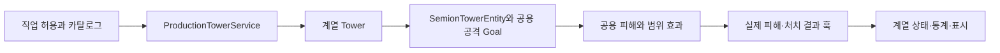

# 신규 빌더 구현 가이드

새 빌더를 직업 선택, 타워 설치·업그레이드, 전투, 증강, 표시, 웹 카탈로그와 검증까지 연결하는 개발 문서다. Java 25 / Minecraft 26.3의 현재 코드와 빌더 책임 분리·전투 시뮬레이션 관련 커밋을 종합한다. 기존 빌더의 수치를 새 계열의 고정 정책으로 가져오지 않고, 실제 API와 생명주기 경계를 기준으로 구현한다.

타워 등록 API는 [프로덕션 타워 카탈로그](production-tower-catalog.ko.md), 현재 계열 목록은 [빌더와 타워](builders-and-towers.ko.md), 수치 체계는 [밸런스 문서](tower-balance-reference.ko.md), 운영 설정은 [설정 문서](config-reference.ko.md)를 함께 본다.

## 1. 먼저 정할 제작 계약

코드를 추가하기 전에 다음 항목을 작은 표로 정한다. 구현과 테스트는 이 계약을 같은 값과 경계로 확인해야 한다.

| 항목 | 결정할 내용 |
|---|---|
| 직업 | 안정적인 job ID, 표시명, 선택 설명, 공식/창작 분류, 활성화 정책 |
| 타워 계열 | 각 tower ID, 역할, 스타터, 티어, 업그레이드 간선 |
| 경제 | 배치 가격, 방향별 업그레이드 가격, 판매·슬롯·특수 자원 규칙 |
| 전투 | 피해 유형, 대상 선택, 사거리, 공격 간격, 광역 대상 수, 발동 조건 |
| 상태 수명 | 타워별·소유자별·팀별 상태, 영구 성장·웨이브 임시 효과·쿨타임 |
| 연결 경계 | 설치·업그레이드·판매·사망·웨이브·탈락·종료·재접속·리로드 |
| 증강·특성 | 후보 직업 조건, 지정 대상, 중첩·재귀·복제 제한, 효과 수치와 설명 |
| 표시·검증 | 모델과 VFX, 동적 상세 정보, 카탈로그 소유권, 단위/서버/클라이언트 검증 |

운영 서버의 밸런스를 다루는 작업이면 활성 `tower_balance.json`과 `economy.json`이 실제 값의 기준이다. 파일이 없거나 읽지 못하면 packaged defaults 기준임을 기록한다. 구현 작업이 운영 설정 덮어쓰기나 서버 기동을 뜻하지는 않는다.

## 2. 수정 지점과 책임 분리

아래 `Example`은 새 계열의 이름을 넣는 자리이며 실제 등록된 빌더가 아니다. 모든 도우미를 처음부터 만들 필요는 없다. 일반 공격 타워로 충분하면 정의·등록·타워·테스트부터 시작한다.

```text
src/main/java/kim/biryeong/semiontd/
  job/ExampleTowerJob.java
  job/JobExampleLifecycle.java
  tower/example/ExampleTowers.java
  tower/example/ExampleTowerCatalogs.java
  tower/example/ExampleTower.java
  tower/example/ExampleState.java
  tower/example/ExampleCombat.java
  tower/example/ExampleStatsView.java
src/test/java/kim/biryeong/semiontd/tower/example/
src/gametest/java/kim/biryeong/semiontd/tower/example/
src/main/resources/semiontd/balance-defaults/tower_balance.json
```

| 책임 | 연결할 실제 소스 |
|---|---|
| 직업 정의·경제 보정·허용 타워 | [SemionJob](../src/main/java/kim/biryeong/semiontd/job/SemionJob.java), [JobRegistry](../src/main/java/kim/biryeong/semiontd/job/JobRegistry.java) |
| 직업 이벤트 전달 | [JobBuilderLifecycle](../src/main/java/kim/biryeong/semiontd/job/JobBuilderLifecycle.java), [JobLifecycle](../src/main/java/kim/biryeong/semiontd/job/JobLifecycle.java) |
| 레인 전후 처리 | [JobLaneLifecycle](../src/main/java/kim/biryeong/semiontd/job/JobLaneLifecycle.java), [PlayerLane](../src/main/java/kim/biryeong/semiontd/game/PlayerLane.java) |
| 타입·스타터·업그레이드 | [TowerType](../src/main/java/kim/biryeong/semiontd/tower/TowerType.java), [ProductionTowerCatalog](../src/main/java/kim/biryeong/semiontd/tower/ProductionTowerCatalog.java), [ProductionTowerCatalogs](../src/main/java/kim/biryeong/semiontd/tower/ProductionTowerCatalogs.java) |
| 설치·강화·판매 | [ProductionTowerService](../src/main/java/kim/biryeong/semiontd/tower/ProductionTowerService.java) |
| 런타임 전투·복사·표시 | [Tower](../src/main/java/kim/biryeong/semiontd/tower/Tower.java), [SemionTowerEntity](../src/main/java/kim/biryeong/semiontd/entity/tower/SemionTowerEntity.java) |
| 설정·설명 | [TowerBalanceConfig](../src/main/java/kim/biryeong/semiontd/config/TowerBalanceConfig.java), [TowerBalanceRuntime](../src/main/java/kim/biryeong/semiontd/config/TowerBalanceRuntime.java), [TowerDescriptionRegistry](../src/main/java/kim/biryeong/semiontd/tower/description/TowerDescriptionRegistry.java) |
| 웹 출력 | [WebCatalogExporter](../src/main/java/kim/biryeong/semiontd/web/WebCatalogExporter.java), [WebCatalogBuilderIndex](../src/main/java/kim/biryeong/semiontd/web/WebCatalogBuilderIndex.java) |

읽기 쉬운 등록 예시는 [ThunderTowerCatalogs](../src/main/java/kim/biryeong/semiontd/tower/thunder/ThunderTowerCatalogs.java), 자원·설치 상태가 있는 계열은 [OceanTowerCatalogs](../src/main/java/kim/biryeong/semiontd/tower/ocean/OceanTowerCatalogs.java)를 본다. 복잡한 성장형은 [WarlockTower](../src/main/java/kim/biryeong/semiontd/tower/warlock/WarlockTower.java)와 [EndTower](../src/main/java/kim/biryeong/semiontd/tower/end/EndTower.java)를 함께 읽어 설정·상태·계산·컨트롤러·표시의 경계를 참고한다. 흑마 희생의 승인 후 성장과 엔드 부분 전이의 복원은 서로 다른 규칙이다.

## 3. 직업 등록과 카탈로그 소유권

직업 객체는 공유된다. 플레이어의 스택·쿨타임·레인·월드를 `SemionJob`의 가변 필드에 보관하지 않는다. job ID와 tower ID는 소문자로 정하고 출시 후 저장·통계·설정과의 호환성을 유지한다.

아래는 직업 정의의 최소 예시다. 실제 제작안의 ID와 설명으로 바꾸고 타워 등록을 별도로 연결한다.

```java
package kim.biryeong.semiontd.job;

import java.util.List;
import java.util.Set;
import kim.biryeong.semiontd.SemionTd;
import kim.biryeong.semiontd.tower.TowerType;
import net.minecraft.network.chat.Component;
import net.minecraft.resources.Identifier;

public final class ExampleTowerJob extends SemionJob {
    public static final Identifier ID = Identifier.fromNamespaceAndPath(SemionTd.MOD_ID, "example");
    private static final Set<String> TOWER_IDS = Set.of("example_guard", "example_guard_elite");

    public ExampleTowerJob() {
        super(ID, Component.literal("예제 빌더"), List.of(Component.literal("제작안의 운영 설명")));
    }

    @Override
    public boolean canUseTower(JobContext context, TowerType type) {
        return includesTowerInCatalog(type);
    }

    @Override
    public boolean includesTowerInCatalog(TowerType type) {
        return type != null && TOWER_IDS.contains(type.id());
    }
}
```

`JobRegistry.registerBuiltIns()`에 직업을 추가한다. 공식 빌더로 분류하려는 경우에만 `OFFICIAL_BUILDER_IDS`도 갱신한다. 선택 가능 여부는 `JobAvailabilityConfig`와 `JobRegistry.isEnabled`의 기존 경로를 사용한다.

`canUseTower(context, type)`는 현재 플레이어의 설치 허용 판정이다. `includesTowerInCatalog(type)`는 상태와 관계없는 공개 소유권이다. 동적 모드·자원·조건을 `canUseTower`에 넣는 계열은 카탈로그 소유권을 별도로 구현한다. 공개 production 타워는 정확히 한 빌더에 연결되어야 한다. `towerGroup`을 사용하면 상점 그룹을 정의할 수 있지만 그룹 표시와 실제 설치 권한은 각각 검증한다.

## 4. 직업 이벤트와 레인 연결 순서

생명주기 이벤트는 `SemionJob`의 공통 8개 훅에서 `JobBuilderLifecycle`의 ID별 `JobLifecycle`로 전달한다. `JobLifecycle`은 package-private이므로 구현은 `job` 패키지에 둔다. `JobBuilderLifecycle.LIFECYCLES`에 명시적인 항목을 추가하고 동작이 없으면 `JobLifecycle.NONE`을 사용한다. 직업 클래스에 이벤트 override를 다시 넣지 않는다.

| 직업 훅 | 신규 구현 시 주의점 |
|---|---|
| `onSelected` | 시작 자원 적용 뒤, `team.addPlayer` 이전이다. 레인이 붙었다고 가정하지 않는다. |
| `onMatchStarted` | 경기별 상태 개설·초기화. 소유자 UUID로 상태를 구분한다. |
| `onRoundStarted` | 준비 단계 시작이다. 실제 웨이브 진입과 구분한다. |
| `onRoundEnded` | 라운드 보상·성장·환급의 기존 순서를 보존한다. |
| `onSummonedMonster` | 구매 승인 경로와 무료·복제·일반 소환의 분류를 유지한다. |
| `onMonsterKilled` | 실제 처치와 귀속된 보상을 기준으로 한 번 반영한다. |
| `onEliminated` | 소유자 상태·팀 효과 정리. 온라인 선행 처리와 순서를 맞춘다. |
| `onMatchClosed` | 정상 종료·취소·탈락 후 재호출에도 안전하게 정리한다. |

선택 해제 훅은 없고 재접속이 선택·경기 시작 훅을 다시 실행하지도 않는다. UI 복원과 전투 상태 개설을 같은 이벤트로 처리하지 않는다. [JobThunderLifecycle](../src/main/java/kim/biryeong/semiontd/job/JobThunderLifecycle.java)는 소유자별 초기화·공유 추첨·탈락·종료 정리의 작은 예시다.

타워나 여러 타워의 웨이브 시작 상태가 필요하면 다음 레인 경계를 사용한다.

| 레인 경계 | 호출 위치 |
|---|---|
| `beforeRoundReset` | 임시 복제 제거 전 |
| `afterTemporaryCopiesRemoved` | 임시 복제 제거 후, 타워별 reset 전 |
| `prepareWave` | 증강·전투 준비 및 라운드 추적 초기화 전 |
| `beforeTowerWaveStarted` | 타워별 `onWaveStarted` 전 |
| `afterTowerWaveStarted` | 타워 훅·라운드 특성 적용 후의 명단·체력·연결 캡처 |
| `beforeTowersCleared` | 타워 제거 콜백 전 |

이 경계들은 엔티티 AI가 움직이기 전후의 훅이 아니라 경기·레인 생명주기다. 실제 웨이브용 명단·초기 체력·연결 스냅샷은 필요한 기존 경계에서 캡처한다. 마왕의 전투 진입처럼 준비 단계와 구분해야 하는 동작을 `onRoundStarted`로 앞당기지 않는다.

경기 종료는 참가자별 `onMatchClosed`, 플레이어 런타임 정리, `closeBeforeLanes`, 레인·타워 종료, `closeAfterLanes`의 순서를 유지한다. 타워 제거가 아직 참조하는 점수·자원 상태를 먼저 지우지 않는다. 경기 취소·오프라인 참가자와 두 번째 종료도 확인한다.

## 5. 타워 정의·팩토리·업그레이드

`<Family>Towers`에서 안정적인 타입 ID와 업그레이드 끝점을 정의하고 `<Family>TowerCatalogs`에서 등록한다. 계열 등록 함수를 `ProductionTowerCatalogs.reloadBuiltIns(TowerBalanceConfig)` 경로에 연결해 첫 시작과 리로드에서 모두 실행되게 한다.

1. `TowerBalanceRuntime.resolve(type)`로 실제 설정이 반영된 타입을 얻는다.
2. 직접 설치할 T1만 `registerStarter`로 등록한다.
3. 상위 티어는 `register(type, factory, tier)`로 등록한다.
4. 모든 끝점을 등록한 뒤 방향별 업그레이드 간선을 연결한다.
5. 간선 가격은 `TowerBalanceRuntime.upgradeCost(from, upgradeId)`에서 얻는다.

아래 구문은 제작안에서 정의한 `from`과 `to`를 사용하는 일반 공격 타워 등록 예시다.

```java
TowerType resolvedFrom = TowerBalanceRuntime.resolve(from);
TowerType resolvedTo = TowerBalanceRuntime.resolve(to);
ProductionTowerCatalog.registerStarter(resolvedFrom, ProductionTower::new);
ProductionTowerCatalog.register(resolvedTo, ProductionTower::new, 2);
ProductionTowerCatalog.linkUpgrade(
        resolvedFrom,
        to.id(),
        to.displayName(),
        resolvedTo,
        TowerBalanceRuntime.upgradeCost(from, to.id())
);
```

특수 동작이 있으면 해당 계열의 팩토리로 바꾼다. `TowerFactory`는 타입·소유자·팀·레인·원래 좌표·현재 좌표를 전달한다. 두 좌표를 받는 생성자를 구현해야 최종 방어 이동 후의 업그레이드에서도 관리 위치와 전투 위치를 보존한다.

설치·강화·판매를 별도 명령에서 직접 재구현하지 않고 `ProductionTowerService`를 사용한다. 강화 시 `Tower.copyFrom(previous, saleValueCost)`가 환급 대상 투자금·공통 데이터·증강 스냅샷을 전달한다. `saleValueCost`는 실제 결제 금액이며 `upgradeCostAddsToSaleValue`가 거부하면 0이다. 환급하지 않는 모드 변경·도박·특수 자원 비용까지 투자금에 합산하지 않는다. 고유 가변 상태는 `copyRuntimeStateFrom`에서 의미에 맞게 복사하고 새 타워와 이전 타워가 변경 가능한 컬렉션을 공유하지 않도록 한다.

상태 복사 후 `PlayerLane.replaceTower`가 이전 타워의 `onRemoved`·detach, 새 타워 attach·`onPlaced`·특성 동기화를 진행한다. 교체와 강화 티켓 승인이 끝난 뒤 `onUpgradeApplied`·`onUpgradeCompleted`가 실행된다. `onRemoved`는 강화·사망·종료에도 호출되므로 판매 보상으로 해석하거나, 이전 타워 정리에서 새 타워가 승계한 소유자 상태를 지우지 않는다. 승인 실패 시 교체 복원도 검증한다.

판매 환급은 누적 실제 투자금과 연결한다. 상위 타워의 배치 가격이 업그레이드 가격이나 누적 투자금은 아니다. 업그레이드 ID와 타워의 논리 정체성을 임의로 다시 생성해 지정 증강·기록 연결을 끊지 않는다.

## 6. 전투 훅과 피해 귀속

일반 기본 공격에는 [ProductionTower](../src/main/java/kim/biryeong/semiontd/tower/ProductionTower.java)를 우선한다. 주기적인 지원 행동은 [SupportTower](../src/main/java/kim/biryeong/semiontd/tower/SupportTower.java)의 `execute(PlayerLane)`를 검토한다. 기본 공격 구조와 수명이 충돌하는 경우에만 `EntityBackedTower`나 별도 책임을 선택한다.



| 필요한 동작 | 사용할 경로 |
|---|---|
| 타워별 적 선택 | `selectAttackTarget`와 공용 `TowerAttackMonsterGoal` |
| 공격력·조건 보정 | 기존 공격 피해 보정 훅과 공용 공격 실행 순서 |
| 실제 적중·처치 후 효과 | `onAttackResolved`의 `dealtDamage`와 `killedTarget` |
| 귀속된 직접 피해 | `Tower.damageTargetResult` |
| 광역 피해·지원 | `SemionTdApi.areaEffects()`, `TowerAreaDamage` |
| 설치·외형 변경·판매 정리 | `onPlaced`, `onStateChanged`, `onRemoved` |
| 웨이브 시작·임시 효과 초기화 | `onWaveStarted`, `resetForRound`와 레인 경계 |

`attemptedDamage`, `resolvedOutgoingDamage`, `dealtDamage`는 같은 값이 아니다. 흡혈·처치 성장처럼 실제 결과를 사용하는 효과를 표시 공격력만으로 계산하지 않는다. 피해 유형과 출처, 처치 전달, 라운드 물리·마법 통계를 함께 유지한다. `aggroPriority`는 몬스터가 타워를 선택하는 우선순위이며 타워 자신의 목표 선택 정책과 구분한다.

`damageTargetResult`는 피해·귀속·통계를 처리하지만 계열의 `onAttackResolved`나 `onKill`을 자동 호출하지 않는다. 일반 기본 공격은 별도의 `SemionTowerEntity.recordAttack`에서 결과 훅과 처치 훅을 호출한다. 신규 스킬·추가 공격·도트는 어떤 계열 훅을 전달할지 명시한다. `TowerAreaDamage`의 `propagateKills=true`는 `onKill`을 전달하므로 같은 처치를 다시 전달하지 않는다. `DamageType`을 생략한 `damageTargetResult`는 `PHYSICAL`이므로 마법·TRUE 스킬에는 유형을 명시하고 기본 공격에는 기존 primary damage 경로를 사용한다.

추가 공격·광역·도트가 자신을 다시 충전하거나 같은 처치를 중복 반영할 수 있는지 설계한다. 공용 범위 API의 레인·팀·소유자 필터와 대상 수 제한을 사용한다. 타워마다 월드 전체 엔티티를 새로 검색하거나 직접 엔티티 피해만 호출해 귀속 경로를 건너뛰지 않는다.

### 신규 빌더가 재사용할 API 경계

배속·시뮬레이션 때문에 별도의 공격력 계산기나 피해 API를 만들지 않는다. 기존 타워·엔티티·범위 효과 경로를 같은 순서로 호출한다.

| 기능 | 기존 공용 경로 | 새 계열의 책임 |
|---|---|---|
| 기본 공격 | `ProductionTower` → `TowerAttackMonsterGoal` → `damagePrimaryAttackTargetResult` → `recordAttack` | 타입·공격력 보정·목표 선택·결과 훅 구현 |
| 스킬·추가 피해 | `Tower.damageTargetResult` / `damageResolvedTargetResult` | 피해 유형과 보정 완료 여부, 결과·처치 훅 전달 정책 선택 |
| 광역 피해 | `TowerAreaDamage` → `SemionTdApi.areaEffects()` | 요청 범위·필터·대상 수·처치 전파 정책 구성 |
| 버프·회복·상태 | 기존 타워·엔티티 효과/회복 API와 계열 상태 | 출처·중첩·만료·실제 회복·표시 일치 |
| 전투 시간·외부 입력 | `CombatSpeedRuntime.gameTime` / 기존 `CombatSimulationRuntime.input` 경계 | 필요한 시계와 승인된 입력 진입점 재사용 |

`CombatSimulationSession`, 워커 요청·토큰·공간 인덱스·가상 엔티티 상태, `finishSimulationStep`·`presentSimulationFrame`는 시뮬레이션의 실행 연결이다. 일반 신규 빌더가 직접 생성·호출하거나 계열마다 복제할 API가 아니다. 기존 공용 API로 표현되지 않는 동작은 그 API의 호출자와 계약을 먼저 확인하고, 필요한 공용 경계만 확장한다.

## 7. 상태 수명과 데이터 복사

| 상태 종류 | 보관 위치와 처리 |
|---|---|
| 타워 하나의 성장·모드 | 타워 인스턴스 또는 typed `TowerDataKey`, 업그레이드 복사 규칙 명시 |
| 소유자 공유 자원·추첨 | 소유자 UUID로 구분한 계열 상태 서비스 |
| 팀 공유 효과 | 팀·경기 경계를 구분하고 참가·탈락·종료에서 갱신 |
| 웨이브 임시 효과·소환 | 라운드/웨이브 reset 및 종료 시 취소 |
| 지연 피해·예약 작업 | 월드/아레나 예약 경로, 실제 실행 시 대상과 경기 유효성 확인 |
| UI·상세 수치 | 현재 상태를 읽는 표시 도우미, 전투 상태나 RNG를 변경하지 않음 |

영구 성장, 임시 효과, 공격 충전, 쿨타임은 reset 대상이 다를 수 있다. 모든 필드를 일괄 초기화하거나 반대로 모두 복사하지 않는다. 업그레이드·이동·사망·부활·판매 각각에서 보존할 상태를 정하고 경계 테스트를 작성한다.

여러 타워의 연결·자원 배분을 캐시할 때는 추가·제거·교체·업그레이드·사망·리로드의 무효화를 함께 구현한다. `PlayerLane`의 순서 있는 스냅샷과 현재 멤버십 검사를 생략하지 않는다. 콜백 중 생성한 타워가 현재 순회에 즉시 끼어들거나 제거된 타워가 계속 실행되는 동작을 만들지 않는다.

순수 상태·계산은 단위 테스트 가능한 도우미로 분리할 수 있다. 월드·엔티티·레인 참조를 가진 가변 컨트롤러는 불변 스냅샷이나 워커 안전 입력으로 취급하지 않는다. 책임 분리는 유지보수 구조이며 성능 향상은 별도 측정한다.

버프·디버프는 `TimedEffectSet`의 출처 정책을 먼저 정한다. 출처 없는 `apply`는 가장 강한 효과를 유지하고 같은 크기에서는 남은 시간과 새 지속 시간 중 큰 값을 유지한다. 출처 있는 `apply`·`refresh`는 출처별 기여를 합산하므로, 오라 제공자마다 안정적인 출처 ID와 제거 경로가 필요하다. 같은 출처에 `apply`를 다시 호출하면 변경하지 않는다. 지속 갱신이 필요하면 `refresh`를 사용한다. 지속 효과는 교체·제거 전까지 남는다. 중첩을 의도한 오라에 출처 없는 API를 사용하거나 동일 출처를 매번 새로 만들지 않는다.

새 효과 유형은 실제 스탯 계산과 한국어 상세창 표시를 함께 연결한다. 최대 체력 보정은 타워와 엔티티의 현재/최대 체력을 동기화하고 의도하지 않은 무료 회복을 막는다. 업그레이드는 새 런타임과 엔티티를 만들기 때문에 지속 효과도 자동 승계된다고 가정하지 않고 복사·재적용·만료를 검증한다.

## 8. 설정·성장 수치·리로드

`TowerBalanceConfig.defaultConfig()`는 `BundledBalanceDefaults`를 통해 packaged JSON을 읽고 코드 기본값을 fallback으로 사용한다. 이 로더는 JSON과 코드 기본값을 병합하지 않는다. 새 계열의 타워·강화 가격·abilities를 `TowerBalanceConfig.codeDefaults()`와 `src/main/resources/semiontd/balance-defaults/tower_balance.json` 양쪽에 추가하고 두 경로를 검증한다. 코드 기본값만 수정하면 정상적으로 읽힌 기존 JSON에 새 값이 생기지 않는다.

운영 파일의 누락 키 보완은 `SemionConfigLoader`의 `withMissingDefaults` 경로다. 리소스 fallback과 구분하고 신규 키 보완 및 기존 설정 보존을 검증한다.

| 설정 영역 | 용도 |
|---|---|
| `towers.<towerId>` | 배치 가격·체력·사거리·공격력·공격 간격 등 공통 스탯 |
| `upgradeCosts` | `fromTowerId->upgradeId` 형식의 방향별 간선 가격 |
| `abilities.<configId>.<key>` | 고유 스킬·버프·지속 시간·자원·성장 수치 |

`upgradeCosts`는 중첩된 출발·도착 객체가 아닌 평평한 `Map<String, Long>`이다. 키는 `TowerBalanceConfig.upgradeKey(fromId, upgradeId)`로 만들고 기존 단일 upgrade ID fallback 호환성을 유지한다.

런타임은 `TowerBalanceRuntime` 또는 계열의 typed config reader를 통해 읽는다. 설명에 동일한 기본 수치를 다시 하드코딩하지 않는다. `TowerDescriptionRegistry`의 템플릿과 같은 런타임 값을 사용하고 해석되지 않은 placeholder가 카탈로그에 남지 않게 한다. 성장 스택·현재 모드·자원은 `runtimeDetailLines()`에 표시한다.

리로드에서는 잘못된 값 거부, 마지막 유효 설정 유지, 누락한 새 키의 보완과 기존 오버라이드 보존을 확인한다. 모든 계열의 실행 중 타워가 자동으로 같은 방식으로 갱신된다고 가정하지 않는다. 새 설치·업그레이드·기존 런타임의 반영 시점을 제작 계약과 실제 caller에서 검증한다.

하이퍼 캐리형이면 `isHyperCarry` 분류만 추가해 끝내지 않는다. 핵심 전투체의 특성 체력 보정, 지정 증강 제한, 성장의 선형 구간과 이후 스케일, 실제 피해 기반 흡혈, 표시 수치를 함께 연결한다. [DamageLifeSteal](../src/main/java/kim/biryeong/semiontd/tower/DamageLifeSteal.java)과 [LogarithmicScaling](../src/main/java/kim/biryeong/semiontd/tower/LogarithmicScaling.java)의 단위·입력·적용 순서를 확인한다. 엔드·흑마·마왕의 승인된 기준값이나 별도 경로를 새로운 빌더의 수치로 임의 대입하지 않는다. 세부 계약은 [프로젝트 구현 참고](../.agents/skills/semiontd-builder-tower-dev/references/implementation.md)에 있다.

핵심 전투체 판정은 [HyperCarryBuilders.isCore](../src/main/java/kim/biryeong/semiontd/job/HyperCarryBuilders.java)에 별도로 연결한다. 현재 이 판정은 엔드·흑마·마왕 타입 조건을 명시하므로 새 직업의 `isHyperCarry()`만으로 핵심 체력 보정이 적용되지 않는다. 핵심 타워의 축소 특성 보정과 일반 보조 타워의 일반 보정을 각각 확인한다.

## 9. 전용 증강·특성·경제 연결

직업 전용 증강의 정의는 [JobAugmentCatalog](../src/main/java/kim/biryeong/semiontd/augment/JobAugmentCatalog.java), 공용 카탈로그는 [AugmentCatalog](../src/main/java/kim/biryeong/semiontd/augment/AugmentCatalog.java)를 따른다. 현재 직업 카드는 review ID, 안정적인 augment ID, 희귀도, 파라미터, 직업 조건과 설명 템플릿을 함께 가진다. 기존 별칭 매핑을 새 ID 정책으로 일반화하지 않는다.

정의만 추가해도 스킬이 자동 실행되지는 않는다. 후보·선택·리롤·지정 대상·실제 적용·취소와 저장/카탈로그까지 연결한다. 다른 직업·다른 소유자의 타워, 복제본·일시 소환·판매한 타워, 지정 중 업그레이드나 웨이브 종료를 검사한다. 증강의 추가 피해나 생성물이 원래 증강을 다시 무한 발동하지 않도록 실제 귀속과 발동 범위를 정한다.

파생 효과의 재발동 억제에는 `AugmentCombat.allowsTriggers()`와 `runWithoutTriggers(...)`의 기존 정책을 참고한다. 정상 기본 공격의 훅까지 일괄 억제하지 않고 생성된 효과의 범위를 검사한다.

시작 자원·소환 비용·인컴·처치 보상은 `SemionJob`의 기존 보정과 공용 `EconomyService`·구매 경로를 사용한다. 신규 버튼에서 직접 지갑을 차감한 뒤 성공 여부를 나중에 검증하지 않는다. 무료 소환·예측 복제·일반 유료 소환과 지출 기록을 구분한다.

## 10. 모델·VFX·UI·웹 카탈로그

새 빌더에 전용 [BuilderPalette](../src/main/java/kim/biryeong/semiontd/entity/tower/vfx/BuilderPalette.java)를 정의하고 [VfxBuilderPaletteSelection](../src/main/java/kim/biryeong/semiontd/entity/tower/vfx/VfxBuilderPaletteSelection.java)에 모든 계열 ID를 연결한다. `TowerVfxService.paletteFor`는 이 선택 경로를 호출한다. 팔레트 enum 선언만 추가하거나 다른 계열/DEFAULT로 조용히 빠지는 상태는 완료가 아니다.

공용 공격·후속 효과·광역 스타일에서 팔레트를 실제 사용하고 비활성 VFX 설정도 확인한다. 바닐라 외형·BlockDisplay·BIL은 `EntityVisual`과 기존 엔티티 렌더링 경로에 연결한다. 상태별 모델은 `visual()`과 `onStateChanged()`의 갱신 경계를 따라간다. 클릭·강화·선택 강조·이름·사망 연출도 함께 확인한다. BIL 제작 세부는 관련 [모델 적용 스킬](../.agents/skills/semiontd-apply-blockbench-tower-models/SKILL.md)과 [BIL 스킬](../.agents/skills/semiontd-blockbench-import-library/SKILL.md)을 따른다.

웹 카탈로그는 실제 등록 타입·업그레이드·빌더 소유권·설명·abilities를 출력한다. `WebCatalogExporter.snapshot()`과 `WebCatalogBuilderIndex` 검증에서 타워가 정확히 한 빌더에 연결되고 방향별 강화 가격이 게임과 같아야 한다. 개인 런타임 설계도처럼 공개 대상에서 제외하는 기존 예외를 일반 production 계열에 적용하지 않는다.

표시 도우미는 순수 조회를 유지한다. 상세창을 여는 것으로 난수를 다시 뽑거나 스택·쿨타임을 변경하지 않는다. 기존 tooltip 형식을 보존하고 실제 클라이언트는 1280×720, GUI scale 2를 기본 확인 조건으로 삼는다. 서버 GameTest가 클라이언트 GPU·실제 다중 접속 검증을 대신하지는 않는다. 보호된 `assets/semion-td/` 모델을 공개 소스나 배포 산출물에 강제 포함하지 않는다.

## 11. 새 빌더의 전투 시뮬레이션 호환 규칙

현재 일반 웨이브는 서버 20 TPS에서 논리 틱을 순서대로 진행한다. 이동·충돌·기술자 회로의 복사된 계산만 전용 워커를 사용하며 AI·타워 훅·피해·처치·경제·월드 API는 서버 스레드에서 실행한다. 신규 빌더가 자신의 훅을 별도 비동기 엔티티 작업으로 옮기는 경로가 아니다.

| 신규 기능 | 지킬 연결 규칙 |
|---|---|
| 스킬 쿨타임·효과 만료 | `CombatSpeedRuntime.gameTime(world)` 등 기존 전투 시계와 논리 훅 사용 |
| 매 틱 행동 | 관리되는 타워 훅에 배속을 다시 곱하거나 같은 훅을 추가 호출하지 않음 |
| 바닐라 Goal | Goal 스케줄러의 실제 호출 간격을 검사; 호출 100회가 게임 틱 100개라는 가정 금지 |
| 직접 이동·밀침 | 논리 scope의 위치·속도 사용, 물리 프레임에서 중복 실행 금지 |
| 지연 명중·소환 | 아레나 예약·순서 경로 사용, 실제 실행 때 대상·라운드·소유자 유효성 확인 |
| 버튼·명령·플레이어 입력 | 읽기·검증·결제·변경·안내를 `CombatSimulationRuntime.input` 경계에 포함 |
| 일반 바닐라 보조 몹 | 기본 상태·AI 후속 단계·접촉·생성 순서·종료까지 별도 소유 지원 확인 |
| 원자적 표시 | 작업 중 위치 대신 마지막 완료 상태를 사용; 모든 UI 상태의 원자성은 별도 확인 |

`SemionTowerEntity`, `SemionMonsterEntity`, `SemionBossEntity`는 기존 소유 경로를 사용한다. 다른 바닐라 몹을 생성하면 스크립트 이동만 논리 시간에 맞춰서는 충분하지 않다. 기술자 구리 골렘은 명시적 등록과 네이티브 body·접촉·회전·풍화·loot 단계가 필요했다. 기술자 전용 `registerEngineerGolem`에 다른 빌더의 몹을 억지로 넣지 않고 새 대상의 책임과 지원을 설계한다.

입력 큐 상한은 256이며 포화 입력을 즉시 실행이나 결제로 우회하지 않는다. 실패한 경기는 전투체 소유권을 유지해 기본 AI의 재실행을 막고 입력 변경을 중단한다. 신규 구매·스킬이 이 상태에서 비용을 차감하거나 기본 물리 행동으로 재시도하는지 검사한다. 플레이어 물리·입력 수신·외부 모드 전체의 가속 동일성을 자동 보장하지 않는다.

현재 배포 배속 상한은 5배속이다. 테스트 전용 8배속 실험이 새 빌더의 8배속 제품 지원·정합성·성능을 증명하는 것은 아니다. 기존 기술자 첫 웨이브의 40 TPS 비교 통과를 새로운 계열 전체의 통과로 확대하지 않는다.

## 12. 커밋에서 반영한 제작 기준

기술문서는 커밋을 단순 시간순으로 나열하는 대신 새 빌더가 따라야 하는 최종 책임을 정리한다. 아래 SHA는 관련 이력을 찾는 대표 지점이며 각 커밋만 독립 적용하는 설치 순서가 아니다.

| 대표 커밋 | 신규 빌더에 적용할 기준 |
|---|---|
| `29c78481` | 직업 정의와 이벤트 구현 분리, 레인 전후 정리와 공유 실행 경로 유지 |
| `1f965840`, `28dc1690` | 성장형의 설정·상태·컨트롤러·전투·표시 분리와 실제 흡혈/증강 연결 |
| `0a2773bb` | 신규 계열을 직업·타워·증강·설정·카탈로그·테스트까지 연결 |
| `1d34bc5f`, `10f95693`, `ff4a46ba` | 네이티브 전투 순서와 서버 훅을 보존하는 시뮬레이션 연결 |
| `f7233874`, `ece70b2b`, `de971f30` | 월드 블록을 쓰는 계열의 순수 모델·입력 버전·표시·예약 복원 구분 |
| `e9124b88`, `65f508c2` | 보조 몹의 body·접촉·회전·아이템·풍화 단계 누락 방지 |
| `8e2b8e69`, `facb7617`, `78ad1e22` | 거래·실시간 밸런스·외부 입력과 오류/포화 경계의 일관성 |
| `f179451d`, `83237527`, `2e8897a7` | 관측 입력과 독립 원본 비교, 실제 검증 범위와 성능 주장 분리 |

설명되지 않은 초기 구현이나 오래된 버전의 예제보다 현재 소스와 실제 호출자가 우선한다. 밸런스 변경이 함께 합쳐져 있으면 상류에서 들어온 수치 변경과 신규 빌더의 제작안을 구분한다.

## 13. 테스트와 완료 조건

계열별 테스트는 구현과 같은 `tower/<family>` 패키지에 둔다. 순수 상태·수치·카탈로그는 JUnit, 엔티티·설치·강화·전투·생명주기·UI·VFX는 Fabric GameTest를 사용한다. 이름은 책임을 드러내는 `*Test`이며 GameTest 애너테이션·인터페이스·source set을 유지한다.

| 검증 대상 | 최소 확인 |
|---|---|
| 직업 등록 | ID 중복 없음, 분류·활성/비활성, lifecycle 항목, 허용/거부 타워 |
| 카탈로그 | 모든 타입과 팩토리, T1 스타터만 노출, 강화 끝점·티어·방향별 가격 |
| 상태와 경제 | 초기 자원·소유자 분리, 강화 복사, 실제 투자·환급, 실패 전 지출 없음 |
| 전투 | 실피해·유형·귀속·처치·재귀 제한, 대상·반경·상한과 동률 순서 |
| 생명주기 | 준비와 웨이브 분리, 임시 소환 정리, 탈락·취소·반복 종료·재접속 |
| 설정 | packaged defaults, 부분 병합, 오버라이드 보존, 불량 값과 리로드 반영 시점 |
| 증강·특성 | 선택·리롤·지정 허용/거부, 실제 효과·상한·설명 일치, 복제/판매 예외 |
| 시뮬레이션 | 한/두 논리 틱, 동결·재개, 지연 명중·스폰 순서, 오류·입력 포화, 보조 몹 |
| 표시·웹 | 실제 팔레트, 외형 변경·상세창, 소유 빌더 하나, 미해석 placeholder 없음 |

공통 등록 계약은 [TowerBuilderCatalogContractTest](../src/test/java/kim/biryeong/semiontd/tower/TowerBuilderCatalogContractTest.java), 직업 이벤트는 [JobBuilderLifecycleTest](../src/test/java/kim/biryeong/semiontd/job/JobBuilderLifecycleTest.java), 웹 출력은 [WebCatalogExporterTest](../src/test/java/kim/biryeong/semiontd/web/WebCatalogExporterTest.java)를 참고한다. 실제 fixture는 기존 `GameTestParticipantFixture`, `AugmentCombatFixture`, `AugmentControllerFixture` 중 필요한 구성을 선택한다. 도우미를 테스트 진입점으로 중복 등록하지 않는다.

엔티티 기반 검사는 아레나·최종 방어 좌표·숨겨진 스킬 전달 엔티티까지 포함하는 테스트 구조를 사용한다. [RuntimeArenaFixture](../src/gametest/java/kim/biryeong/semiontd/gametest/RuntimeArenaFixture.java)는 `areEntitiesActuallyLoadedAndTicking`으로 실제 엔티티 구역 준비를 확인한다. `FullChunkStatus.ENTITY_TICKING`만으로 준비됐다고 가정하지 않는다. 플레이어·청크가 필요한 검사는 기존 `RuntimeEnvironmentFixture`·`RuntimePlayerFixture`의 준비 조건을 사용하고 setup·검증·cleanup을 같은 실행에 유지한다.

새 GameTest 클래스는 [fabric.mod.json](../src/gametest/resources/fabric.mod.json)의 `fabric-gametest`에 등록하고 필터로 실제 실행되는지 확인한다. 컴파일 성공이나 다른 계열의 기존 검사만으로 신규 동작의 완료를 보고하지 않는다.

```powershell
.\gradlew.bat test --console=plain --no-daemon
.\gradlew.bat test runGameTest remapJar --console=plain --no-daemon
git diff --check
```

구체적인 단위 테스트 필터와 GameTest 필터는 만든 클래스·메서드의 실제 이름으로 지정한다. 전체 gate는 게임 변경의 최종 통합 확인이다. 실행한 명령·실패/제외·환경 원인·미수행 클라이언트 검증을 구분해 남긴다. 라이브 밸런스 결론이나 CPU/MSPT 개선은 같은 규칙·작업량의 관측·성능 결과를 별도로 첨부한다.

## 14. 실제 구현 순서

1. 제작 계약을 확정하고 가까운 계열의 정의·등록·런타임·테스트를 읽는다.
2. 안정적인 job/tower/upgrade/config/augment ID를 정하고 직업·lifecycle를 등록한다.
3. 기본값·타입·팩토리를 추가한 뒤 모든 업그레이드 간선을 연결한다.
4. 공용 설치·피해·범위·경제 경로에서 최소 전투 동작을 구현한다.
5. 필요한 상태의 수명·업그레이드 복사·reset·종료·예약 취소를 연결한다.
6. 특성·전용 증강·모델·팔레트·설명·상세창·웹 출력까지 갱신한다.
7. 신규 상태와 실제 서버 흐름을 검증하고 시뮬레이션 경계의 누락을 확인한다.
8. 전체 gate와 필요한 실제 클라이언트 검증을 완료하고 설정·호환 영향과 남는 범위를 문서화한다.

이 순서는 테스트 없는 대량 구현을 먼저 끝내는 절차가 아니다. 각 책임 단위에서 실제 실패·성공 경계를 확인한 뒤 다음 연결을 진행한다.
